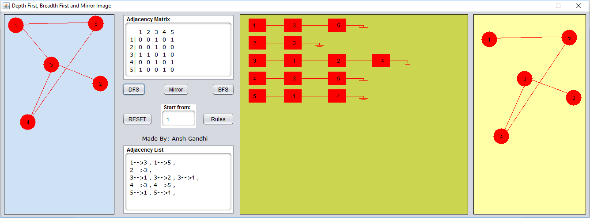
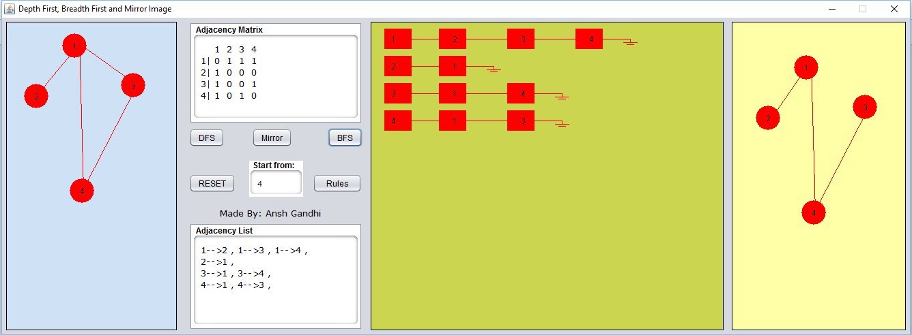

# Graphical Depth First Search and Breadth First Search

The Application makes DFS, BFS Tress and creates Adjacency Matrix and Adjacency Lists as the nodes nad edges are created.

<ol>
<li>Click on Blue Pane to draw Vertices</li>
<li>Press mouse on any Node and Drag mouse to the desired node to create an Edge</li>
<li>Type in the Start Node</li>
<li>Choose BFS - Breadth First Search or DFS - Depth First Search</li>
<li>Bonus: You can Mirror the Graph too.</li>
</ol>

Depth First Search

Breadth First Search
